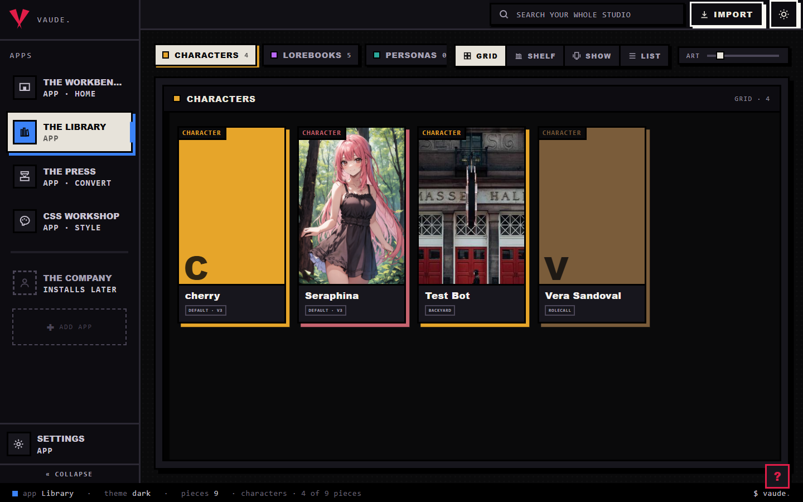
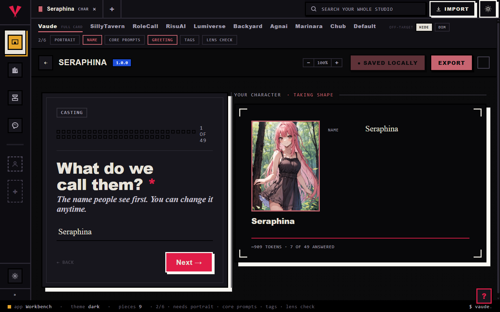
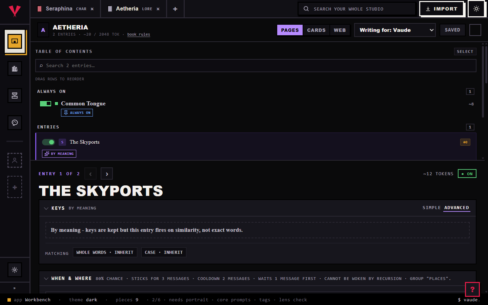
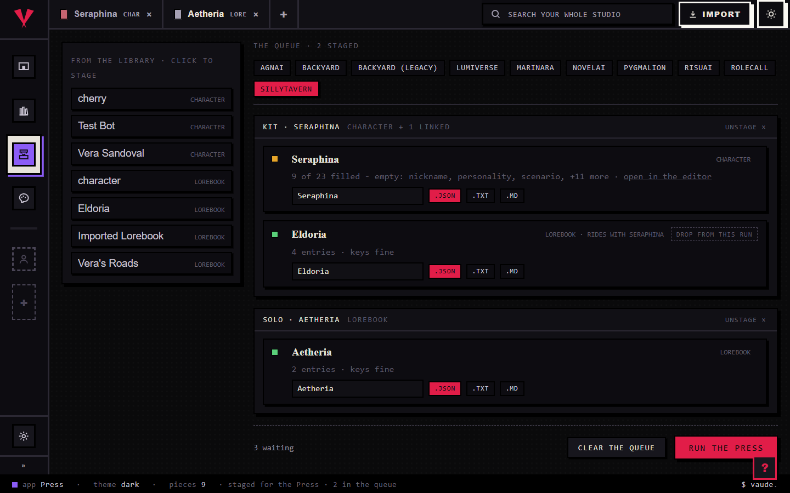

<div align="center">


<sub>· A CONEJA-CHIBI PRODUCTION ·</sub>

<picture>
  <source media="(prefers-color-scheme: dark)" srcset="docs/media/hoplight-wordmark-dark.png">
  
</picture>

*Every platform invented its own card format. Hoplight speaks all of them.* 🐰

<p>
  
  
  
</p>

</div>

---

### 💡 The Core Thesis

> **You should be able to create, edit, and interact with all your work in an app linked to no platform, and port it out when you choose. A storage vault, a creator's lab, or both.**

Everything in this repo follows from that sentence. One canonical model in the middle, an honest
adapter per platform, and your whole library as plain JSON on your own disk. No accounts, no
telemetry, no cloud.

---

## 🎪 What is Hoplight?

A home base for AI-roleplay work. Characters, lorebooks, personas, presets, regex sets, and
sprites all live in one local studio with real editors, instead of being scattered across whatever
apps happen to read their formats. When you want to publish somewhere, you export to that
platform's format; the piece you keep working on is always your own copy.

Right now that's hard to do. Every platform has its own card format, cards drift apart when you
maintain a copy per platform, and an embedded lorebook can only be edited inside the app that made
it. Hoplight reads all of those formats into one canonical model and prints back out to any of
them, so the platforms become publish targets instead of the place your work lives.

| Elsewhere | In Hoplight |
|---|---|
| One copy of the character per platform | One piece, exported to any platform |
| Embedded lorebook, editable nowhere | A real editor, and the book stays linked to its character |
| Exports silently drop what doesn't fit | A report that names exactly what moved and what didn't |
| Your library on someone else's server | A folder of JSON on your own disk |
| Guessing which fields a platform reads | An editor lens that dims what the target won't carry |
| Embedded scripts run on trust | Scripts carried as data, never executed |

---

## 🎞️ One Card, Start to Finish

```
You drop Seraphina.png into the studio
 ↓
🔍 Detection figures out what it is (ST card? Risu? Backyard archive? lorebook?)
 ↓
🧾 You get a receipt in actual sentences:
   "Seraphina. A character card, made for SillyTavern.
    We kept her portrait, her greeting, and the lorebook that came embedded."
 ↓
🗄️ The ORIGINAL file is stored inside the saved piece (escrow),
   so nothing you imported can ever be lost by editing it
 ↓
📚 The embedded lorebook becomes its own editable piece, still linked to her
 ↓
✍️ You edit with the lens set to "RisuAI":
   fields Risu won't carry are dimmed, so you know before you export
 ↓
🖨️ You stage her for the Press → her linked book rides along automatically
 ↓
📦 One zip: seraphina.charx, her lorebook, and an honest per-file result line
```

That's the whole loop. Import honestly, edit with your eyes open, export with receipts.

---

## 🖥️ The Rooms

### 📚 The Library *(everything you own, one room)*



Every piece in your studio, split into decks by kind with live counts, cover art pulled from the
cards themselves, and a continuous art-size dial.

| View | What you get |
|---|---|
| **Grid** | Art-forward cards in a fluid grid; the default |
| **Show** | One piece at a time: hero art, its own tagline, prev/next |
| **List** | Dense rows when you have hundreds of pieces |
| **Shelf** | The fourth view; browse by spine |

**Import is drag-and-drop anywhere.** Every import produces a receipt in sentences: what the file
is, what was kept, and whether a lorebook came embedded. No stack traces, ever.

**Multi-select is staging.** Tap pieces into a staging set (it survives deck switches), then send
the whole batch to the Workbench in one action. Right-click any piece for the one-shot menu:
send, open beside, stage for the Press.

**Each deck has its own shelf operations.** Lorebooks can be merged and split; regex sets can be
duplicated, toggled, and combined; characters carry their linked books with them.

### 🎬 The Workbench *(the casting office)*



Characters are built through a **casting interview**: one question at a time with a progress
count, while the proof sheet beside it fills in live, token estimate included. Answer what you
want, jump around, watch the card take shape.

**The platform tabs are the lens.** Pick who you're writing for and the editor dims every field
that platform won't carry, with Hide and Dim modes for off-target fields:

| Tab | What it edits |
|---|---|
| Hoplight | The full canonical card, everything |
| SillyTavern, RoleCall, RisuAI, Lumiverse, Backyard, Agnai, Marinara, Chub | That platform's view of the card, plus its native field bags |
| Default | Portable CCv3 for thin hosts |

**A readiness strip** tracks the card at a glance: portrait, name, core prompts, greeting, tags,
lens check. **Rich platforms get native editors** for their platform-specific fields, so a Risu
card's extras are edited as real controls, not a JSON blob. Open pieces live in the shell's tab
strip, so they survive switching rooms, and any two pieces can sit side by side in a split.

### 📖 The Binder *(lorebooks as a real editor)*



A lorebook stops being a wall of JSON: a table of contents with drag-reorder and search, an
always-on section for pinned entries, and one page per entry.

| Entry controls | What they do |
|---|---|
| **Keys** | Simple or advanced trigger modes, primary + secondary keys, AND/OR logic |
| **By meaning** | An entry can fire on similarity instead of exact words; keys are kept either way |
| **Matching** | Whole-words and case tri-states that inherit from book defaults |
| **When & where** | Chance, sticky, cooldown, delay, insertion position and depth, recursion controls, groups, all in one plain-words line |
| **Budgets** | Token budget with honest per-entry estimates, always marked as estimates |

**Health checks run as you edit**: an entry with no keys and no always-on flag can never fire, and
the binder says so instead of letting you ship a dead entry. **Write-for** works here too: pick
the host platform and the binder shows what its wire actually carries.

### 🖨️ The Press *(batch export that tells the truth)*



Stage pieces from anywhere (right-click, or the rail in the room), pick one target platform, pull
the lever.

| The Press | Behavior |
|---|---|
| **Kits** | A character travels with his linked lorebooks automatically, even ones you never staged; drop a rider from one run without unlinking anything |
| **Readiness** | Every card shows what the target will carry: "9 of 23 filled - empty: nickname, personality, ..." with a jump to the editor |
| **Lorebook checks** | A book whose entries can never fire says so in red before you print it |
| **Filenames + flavor** | Name every file, and text formats can print as .json, .txt, or .md |
| **Honest results** | Skips declared before the run, failures name their error, one zip for everything that printed |

Platforms that read CCv3 with their own extension bags (Marinara, Chub) print characters as a CCv3
card, their native file, and the row says so.

### 🎨 The CSS Workshop *(restyle the studio itself)*

Live theme editing against real components: every color in the app is a token, and the workshop
edits them while you watch. The same guard that keeps hardcoded colors out of the codebase keeps
your theme portable.

### ⚙️ Settings *(drop-in, like everything else)*

Sections are drop-in folders: Appearance (theme + accent), Studio (home app, first deck, publish
targets), Workbench (follow behavior). Every control is live against the running studio.

---

## ⚙️ How It Actually Works

```
SillyTavern ──┐                ┌── RisuAI
Backyard ─────┤                ├── RoleCall
Agnai ────────┤   canonical    ├── Chub
Pygmalion ────┤     model      ├── Lumiverse
NovelAI ──────┤                ├── Marinara
CCv3 ─────────┘                └── ...your studio, as JSON
```

- **Hub and spoke.** N platforms cost N adapters, not N². Adding a platform is dropping a folder
  in; the round-trip suite tells you whether your adapter is honest.
- **Escrow.** The original file rides inside the saved piece. Same-format round trips are
  byte-honest, and CI enforces it on every commit.
- **Sealed scripts.** Cards can carry Lua, macros, regex payloads. Hoplight inspects, reports,
  and preserves them. It runs none of them.

## ❓ FAQ

**Is my content private?**
Yes. Loopback-only local server, zero outbound calls in the codebase, no accounts. Your studio
folder is JSON you can read yourself.

**Can a conversion damage my cards?**
No. The original is escrowed inside the saved piece, same-format round trips are lossless, and
cross-format conversions report what mapped and what didn't.

**Do I need an API key?**
No. Nothing here calls an AI. Planned AI features will be BYOK and opt-in, and their
deterministic parts will work keyless.

**Will it run scripts embedded in cards?**
No. Carried as data, exported faithfully, never executed.

**Which platforms?**
SillyTavern (V2/V3 JSON, PNG, charx), RisuAI, RoleCall, Backyard (.byaf + legacy), Agnai,
Pygmalion, Lumiverse, Marinara, Chub, NovelAI lorebooks, portable CCv3 for everything else.
Per-field detail: [docs/FORMAT-SUPPORT.md](docs/FORMAT-SUPPORT.md).

**A platform I use isn't supported. Can it be?**
Formats are drop-in adapter folders. Open an issue with sample files, or add the folder yourself.
The round-trip suite will tell you whether your adapter is honest.

**CLI or app?**
Both, same engine. The studio is the daily driver; the CLI does convert, inspect, validate, and
label for scripts and batch work, with `--json` output.

**Why AGPL?**
So nobody closes this up and sells it back to the community it came from.
[LICENSING.md](LICENSING.md) has the plain-terms version.

**What does the name mean?**
Hop + limelight. The V is the maker's mark, the tapered H is the app's.

## 🚀 Quick Start

Requires [Bun](https://bun.sh) 1.3+.

```bash
git clone https://github.com/Coneja-Chibi/vaudeville-studios
cd vaudeville-studios
bun install

bun run vaud formats                                          # what can we open?
bun run vaud inspect samples/sillytavern/Seraphina.png        # peek at a card
bun run vaud convert samples/sillytavern/v3-full.json out.charx --to risu
bun run dev                                                   # the studio, local only
```

| Command | Purpose |
| --- | --- |
| `vaud convert <in> <out> [--to id]` | Convert between formats |
| `vaud inspect <file>` | Plain-words summary of any file |
| `vaud validate <file>` | Detect + parse; exit 0 if openable |
| `vaud label <file>` | Guess format and likely origin |
| `vaud formats` | List every adapter |
| `vaud ui [port] [studioDir]` | The visual studio (loopback only) |

## 🗺️ The Roadmap

Full version with exit criteria: [docs/ROADMAP.md](docs/ROADMAP.md).

| | What it is | Status |
| --- | --- | --- |
| Engine + converter | Canonical model, escrow, round-trip law in CI, convert/inspect/validate | ✅ Done |
| Character editing | 9+ platforms, native field editors, the lens | ✅ Done |
| Content types | Lorebook, regex, persona, media editors; preset editor in build | ✅ · 🔨 |
| The studio app | Already the daily driver; desktop packaging left | 🔨 |
| CLI / TUI | A real terminal face for the engine, beyond today's basic commands | 🚧 WIP |
| Slop detection | Programmatic slop detector + deterministic card audits with a health score, no API key | 🎫 Planned, tickets cut |
| The agent | An agent loop over your studio: BYOK + local models, staged edits it can never commit alone, eval harness before features (ADR-006) | 🕐 Planned |
| Prompt evolution | GEPA-style reflective optimization of prompts and cards against evals | 🕐 Planned |
| Interview engine | Grows a card from a conversation instead of a form | 🕐 Planned |
| Productions | Workspaces, content-addressed history, test stage | 🌗 Test bench live |
| Log distillation + worlds | Characters distilled from real chat logs with citations; grown worlds | 🕐 Planned |

Near-term: the Press ledger, the mascot landing in tours and empty states, reference pages for the
newest four adapters, the capability sandbox design.

## 🏗️ Architecture (For the Curious)

Bun + TypeScript, strict. Pure engine core, side effects at the edges; the CLI and studio are thin
shells over one engine. The filesystem is the schema: apps, format adapters, settings sections,
and deck views are all drop-in folders that register by existing.

```
src/
  core/         : canonical model, detection, coverage, lore/regex/macro engines
  entities/     : per-kind schemas (character, lorebook, persona, preset, ...)
  formats/      : one folder per platform - drop one in, the studio gains a format
  studio/       : local-first storage; one entity = one JSON file, atomic writes
  sandbox/      : the sealed-script analysis layer (inspect, never execute)
  ui/           : the local server + the React studio
  cli.ts        : the same engine, argv-shaped
```

<details>
<summary><b>src/core</b> · the engine</summary>

```
canonical.ts     : the canonical entity envelope every format maps into
                   (schemaVersion, kind, id, body, original escrow)
adapter.ts       : the contract a format adapter implements (read/write/detect)
registry.ts      : the live roster of loaded formats
loader.ts        : loads format folders into the registry
detection.ts     : "what is this file?" - sniffs bytes/shape into a format id
coverage.ts      : per-platform claims of which canonical paths a wire carries;
                   ground truth for the editor lens AND the Press readiness lines
archive.ts       : bounded zip/archive reading (size-capped, no zip bombs)
tag-taxonomy.ts  : the shared tag vocabulary
lore/            : lorebook engine - activation, budgets, eviction, empty-book factory
media/           : portraits, sprite packs, export summaries
persona/ preset/ regex/ : per-type engines shared by editors and codecs
```
</details>

<details>
<summary><b>src/entities</b> · what a piece IS</summary>

```
character/ lorebook/ pack/ persona/ preset/ regex/
```

One folder per content type, holding its canonical schema. Codecs map platform wires into these
shapes and back; editors edit exactly these shapes. Nothing else in the codebase defines what a
character is.
</details>

<details>
<summary><b>src/formats</b> · one folder per platform</summary>

```
sillytavern/  risu/  rolecall/  backyard/  agnai/
pygmalion/    lumiverse/  marinara/  novelai/  vaud-json/
_template/    : copy this to start a new adapter
_shared/      : logic shared by more than one codec, extracted exactly once
_fixtures/    : real files the round-trip suite chews on
```

Each folder default-exports its adapter: detect, read to canonical, write from canonical, plus a
coverage declaration. Drop a folder in and the CLI, the studio, the export dialog, and the Press
all gain the format with zero central registration. `vaud-json` is the studio's own storage format.
</details>

<details>
<summary><b>src/studio</b> · local-first storage</summary>

```
store.ts           : one entity = one JSON file under <studio>/<kind>/<id>.json;
                     keep-both id minting, fail-closed schema validation
atomic-file.ts     : exclusive/atomic-replace writes - no half-written pieces
path-policy.ts     : path containment; ids can never escape the studio folder
bundle.ts          : character + related lorebooks saved as one operation
portrait.ts        : extracts displayable art from carried card files
settings.ts        : the per-studio settings document, parsed fail-closed
signature-color.ts : pulls an accent color from a card's PNG art
```
</details>

<details>
<summary><b>src/sandbox</b> · sealed scripts</summary>

```
lua/       : analysis of Lua blobs cards carry (bounded, never executed as user code)
triggers/  : the Risu Workshop test bench - sealed trigger evaluation on a card-local stage
```

The rule everywhere else is simpler: scripts are data. This folder is where they get inspected.
</details>

<details>
<summary><b>src/ui</b> · the server and the shell</summary>

```
server.ts          : the loopback HTTP server - session token, fail-closed parsing
server-security.ts : origin/fetch-metadata checks, CSP with per-response script hashes
server-engine.ts   : the API's engine calls (inspect, convert, coverage, studio)
server-static.ts   : static serving + dev live-reload watcher
api.ts             : the client's one door to the API
app-contract.ts    : the AppContext handed to every app - IO, workbench, press,
                     menus, prefs; apps never import the engine directly
receipt.ts         : plain-words import receipts, rendered server-side
boot.ts            : client boot - discovers apps, mounts the shell
shell/
  App.tsx          : the frame - canvas, app switching, follow dialogs
  Dock.tsx         : the app dock (manifest-driven, collapsible)
  TabStrip.tsx     : open pieces; the workbench's tabs live in the shell
  store.ts         : shell state - open pieces, press queue, theme, status
  menus.ts         : THE right-click system; apps register providers
  error-boundary.tsx, StatusBar.tsx, FollowDialog.tsx, Menu.tsx
setup/             : the first-run wizard steps (drop-in folder per step)
tours/             : the ? tours, one folder per app
theme/tokens.css   : every color in the app; the guard blocks hardcoded ones
```
</details>

<details>
<summary><b>src/ui/apps</b> · the rooms (drop-in folders)</summary>

```
library/      : browse room - decks by kind, grid/showcase/list views, import,
                multi-select staging, shelf ops per content type
workbench/    : the editors - guided character interview, native platform bags,
                the lorebook binder (lore/), regex bench (regex/), persona and
                preset editors, the platform lens
press/        : batch export - the staged queue, kits (character + linked books),
                readiness lines from coverage, one zip per run
settings/     : drop-in sections (appearance, studio, workbench)
css-workshop/ : live theme editing on real components
company/      : reserved seat (the agent, later)
```

An app is a folder default-exporting a manifest + component. The dock builds itself from
whatever folders exist.
</details>

<details>
<summary><b>src/ui/components</b> · shared controls</summary>

Fifty-plus extracted-once controls, from structural (bento-card, ink-dialog, bottom-sheet,
platform-tabs, lens-rail) to content-specific (sprite-pack, expression-map, native-card,
knowledge-rail, ticket-window) to inputs (paint-picker, swatch-row, toggle-switch, slider,
code-editor). The catalog with usage rules lives in
[docs/reference/components.md](docs/reference/components.md) and a CI check keeps it current.
</details>

<details>
<summary><b>Gates</b> · what CI actually enforces</summary>

```
~1,950 tests        : engine, codecs, round-trip law, store, server, UI cores
color-token guard   : no hardcoded colors outside theme/tokens.css
file-size cap       : 500 lines per file; split, not grandfather
prose gates         : no em dashes, no dead doc links
component catalog   : docs/reference/components.md must match the folders
format matrix       : docs/FORMAT-SUPPORT.md regenerates from the live registry
license audit       : build fails on restricted dependencies
```
</details>

| Read order | |
| --- | --- |
| [docs/01-VISION.md](docs/01-VISION.md) | What this is for, and who for |
| [docs/02-ARCHITECTURE.md](docs/02-ARCHITECTURE.md) | The canonical model and how adapters hang off it |
| [docs/03-CONVENTIONS.md](docs/03-CONVENTIONS.md) | Code style and the rules the hooks enforce |
| [docs/reference/](docs/reference/README.md) | Per-format, per-entity, per-surface reference |
| [docs/decisions/](docs/decisions/ADR-001-runtime.md) | Why the consequential choices went the way they did |

---

<div align="center">

*Your favorite rabbit's favorite ~~rabb~~ perfectly normal woman.* 🐰💋✨

</div>
