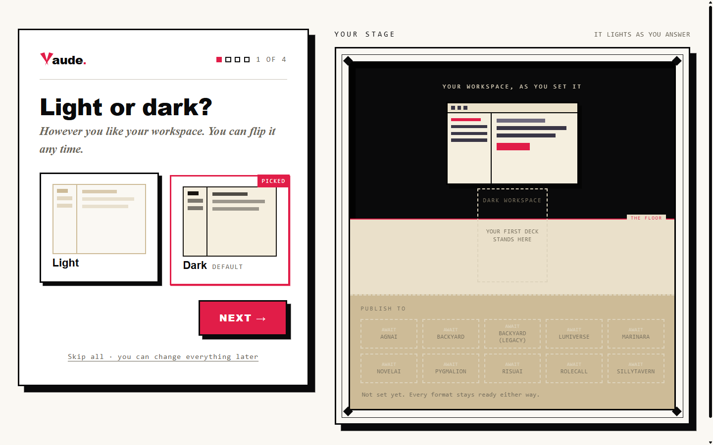

<div align="center">

<picture>
  <source media="(prefers-color-scheme: dark)" srcset="docs/media/vaude-wordmark-dark.png">
  
</picture>

<h1>Hoplight</h1>
<h3>The local-first studio for AI-roleplay content.</h3>

<p>Characters, lorebooks, personas, presets, regex, sprites.<br>
One canonical model, an adapter per platform, nothing leaves your machine.</p>

<p>
  <a href="docs/FORMAT-SUPPORT.md">Format matrix</a> ·
  <a href="docs/ROADMAP.md">Roadmap</a> ·
  <a href="docs/01-VISION.md">Vision</a> ·
  <a href="LICENSING.md">AGPL-3.0</a>
</p>

</div>

---

Every AI-roleplay platform invented its own card format, and they all disagree about what a
character even is. Hoplight reads them all into one canonical model, lets you edit with full
knowledge of what each platform will and will not carry, and prints back to any of them.
Same-format round trips are byte-honest; cross-format conversions tell you exactly what moved and
what stayed home. It runs entirely on your machine: no accounts, no telemetry, no cloud. Your
studio is a folder of plain JSON files you can version, back up, and grep.

Hoplight is a **Vaudeville Studios** production; the searchlight wordmark is the house mark. The
app, its native format, and the CLI all answer to the same name.

## The studio

<table>
  <tr>
    <td width="50%">
      
      <p align="center"><sub><b>The Library</b> · every piece you own, browsable by kind, art forward</sub></p>
    </td>
    <td width="50%">
      
      <p align="center"><sub><b>The Workbench</b> · a guided casting interview builds the card while the proof sheet takes shape</sub></p>
    </td>
  </tr>
  <tr>
    <td width="50%">
      
      <p align="center"><sub><b>The binder</b> · lorebooks as a real editor: keys, activation rules, budgets, health checks</sub></p>
    </td>
    <td width="50%">
      
      <p align="center"><sub><b>The Press</b> · batch export: a character travels as a kit with his linked books, every card states its readiness</sub></p>
    </td>
  </tr>
</table>

<details>
<summary>First run: the setup wizard</summary>
<br>

<p><sub>Four questions, a stage that lights up as you answer, and everything can change later.</sub></p>
</details>

### What it actually does

- **Converts honestly.** Hub and spoke: every format maps to one canonical model, so N platforms
  cost N adapters, not N². What a platform cannot carry is reported, never silently dropped, and
  the original file rides along in escrow so a same-format round trip loses nothing.
- **Edits with a lens.** Pick the platform you are writing for and the editor dims what that
  platform will not carry. No guessing which fields survive the export.
- **Kits, not files.** A character owns his linked lorebooks. Import a card and its embedded book
  becomes a real, editable piece; print the character and the book rides along.
- **Executes nothing.** Cards can carry scripts. Hoplight treats them as sealed data: inspected,
  reported, carried faithfully, never run.
- **Plain-words receipts.** Every import tells you what it read and what it kept in sentences,
  not stack traces.

## Quick start

Requires [Bun](https://bun.sh) 1.3 or newer.

```bash
git clone https://github.com/Coneja-Chibi/vaudeville-studios
cd vaudeville-studios
bun install

# what can we open?
bun run vaud formats

# peek at a card
bun run vaud inspect samples/sillytavern/Seraphina.png

# convert ST JSON to a Risu .charx
bun run vaud convert samples/sillytavern/v3-full.json out.charx --to risu

# the studio, local only
bun run dev
```

## The CLI

| Command | Purpose |
| --- | --- |
| `vaud convert <in> <out> [--to id]` | Convert between formats |
| `vaud inspect <file>` | Plain-words summary of any file |
| `vaud validate <file>` | Detect + parse; exit 0 if openable |
| `vaud label <file>` | Guess format and likely origin |
| `vaud formats` | List every adapter |
| `vaud ui [port] [studioDir]` | The visual studio (loopback only) |

`--json` on inspect/validate/formats/convert for machine output. `bun run build:cli` compiles a
single executable.

## Platforms

SillyTavern (V2/V3, JSON + PNG + charx), RisuAI, RoleCall, Backyard (.byaf + legacy), Agnai,
Pygmalion, Lumiverse, Marinara, Chub, NovelAI lorebooks, and portable Default CCv3 for thin hosts.
The full auto-generated support table with per-field honesty lives in
[docs/FORMAT-SUPPORT.md](docs/FORMAT-SUPPORT.md).

## Where it is, where it goes

Ground truth with exit criteria per milestone: [docs/ROADMAP.md](docs/ROADMAP.md). The deeper
plans (per-jewel build docs, ticket decks through M3) live in the production notes.

### ✅ Shipped

The foundation: canonical schemas, escrow envelope, PNG codec, and the round-trip law enforced in
CI. The converter CLI. The character forge, closed against nine-plus platforms with native field
editors and a per-platform honesty lens. The media pipeline (portraits, sprite packs). The full
lorebook binder. Regex and persona editors. The Risu Workshop with its sealed test bench. The
Press with kit-grouped batch export.

### 🔨 In the shop

- 🃏 **The preset editor** · the last content type; the hybrid editor design is locked and the
  build plan is phased
- 🖨️ **The Press ledger** · run history, saved print jobs, re-print, and "edited since" staleness
  flags
- 🐰 **Hoplight herself** · the stagehand rabbit takes over the tours, empty states, and loading
  beats; mark candidates drawn, one gets picked
- 📚 **Reference pages** for the four newest platform adapters
- 📦 **Desktop packaging** · the studio already runs as the daily driver; formal releases remain

### 🗺️ Next

- 🩺 **The Script Doctor** · deterministic card audits (format errors, token waste,
  contradictions, slop banks) with a health score; runs with no API key; ticket deck already cut
- 🔐 **The capability sandbox** · a three-layer design for someday running card scripts safely;
  until it ships, scripts stay sealed data by law
- 🧠 **The Brain** · provider layer and an agent loop over your studio; bring your own key, local
  models included

### 🎭 The long game

- 🎤 **The Table Read** · an interview engine that grows a card from a conversation, from a
  five-minute Cold Read to a Deep Dive
- 🎬 **Productions** · workspace folders with content-addressed history: edit a field, replay the
  same test line, watch the output change
- 🗃️ **The Archives + the World Forge** · distill characters from real chat logs with per-claim
  citations; interview-grown worlds with a standing continuity desk
- 🏢 **The Company** · the dock already holds its seat

## Under the hood

Bun + TypeScript, strict. A pure engine core with side effects pushed to the edges; the CLI and the
studio are two thin shells over the same engine. Apps in the studio are drop-in folders, format
adapters are drop-in folders, settings sections and deck views are drop-in folders: the filesystem
is the schema. Around 2,000 tests run in CI alongside a color-token guard, a file-size cap, prose
gates, and a license audit that fails the build if a restricted dependency sneaks in.

| Read order | |
| --- | --- |
| [docs/01-VISION.md](docs/01-VISION.md) | What this is for, and who for |
| [docs/02-ARCHITECTURE.md](docs/02-ARCHITECTURE.md) | The canonical model and how adapters hang off it |
| [docs/03-CONVENTIONS.md](docs/03-CONVENTIONS.md) | Code style and the rules the hooks enforce |
| [docs/reference/](docs/reference/README.md) | Per-format, per-entity, per-surface reference |
| [docs/decisions/](docs/decisions/ADR-001-runtime.md) | Why the consequential choices went the way they did |

## License

[AGPL-3.0-or-later](LICENSE). Use it, change it, share it; the freedom travels with the code.
Plain-terms explanation in [LICENSING.md](LICENSING.md). Dependencies stay permissive, enforced by
`bun run license:audit`.

<div align="center">
<sub>a Coneja-Chibi production</sub>
</div>
