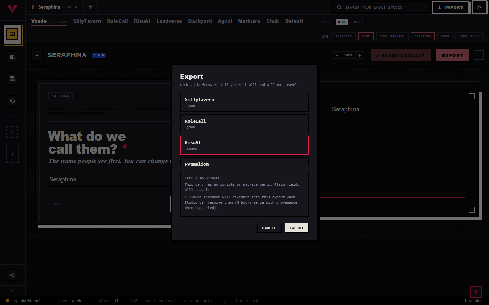

# Convert a card

Converting takes a card you have in one app's format and writes it back out in another app's format. Most of it crosses cleanly, but some things, like an app's private scripts, are left behind on purpose, and this page tells you which.

## The short version

1. **Import your card into the Library.** Drop the file onto the shelves, or use Import files. A receipt shows what was read; leave the checkbox on for anything you want to keep and click Import.
2. **Open it on the Workbench, or skip ahead.** If you want to edit first, right-click the piece and choose Send to the Workbench. If it is fine as-is, you can go straight to staging.
3. **Stage it for the Press.** Right-click the piece and choose Stage for the Press, or click it on the Press left rail. A staged character brings its linked lorebooks along with it.
4. **Pick the target format.** In the Press, click the platform you are converting to. It is one target per run.
5. **Export.** Click run the press, then download the bundle. Your converted file lands in a single zip named for the platform.

## What survives and what drops

@fig pipeline

Every convert passes through one shared model in the middle. Your file is read into that model, then written back out in the target app's shape. That one detail explains both of the rules below.

**Same app, round-trip: everything is kept.** When you convert a card back to the app you started in, nothing is lost. The Library keeps a copy of your original file, so anything the shared model does not have a slot for, private extensions, layout, ids, comes straight from that saved copy on the way out.

**A different app: what it understands is kept, the rest stays behind.** Only the shared middle model crosses to a new app. If the target has no place for something, it does not travel, and one app's private scripts are never copied into another app's file. That is the safe choice, not a missing feature: you do not want one app's code hitchhiking into another that never asked for it.

A concrete case. Say your card carries trigger scripts and regex, and you convert it to a plainer app like Agnai or legacy Backyard. The name, description, and greetings all arrive. The scripts do not, because that app has no place to run them. If you need the full rule pack to travel, convert to a format that keeps it, like Risu (.charx), instead.

You never have to guess what will happen. Every export shows you first. From an editor on the Workbench, the Export button opens the honesty view: pick a platform and it lists what will and will not travel, line by line, before you commit.

## Converting many at once

The Press converts a whole set in one go. Stage every piece you want (right-click each and choose Stage for the Press, or use the left rail); the queue survives switching between rooms. Pick one target, click run the press once, and every piece prints into a single zip.

Each row prints its own honest result: printed with a note on what it carries, skipped when the target has no format for that kind of piece, or failed with the error. A staged character travels as a kit: it drags its linked lorebooks along as riders, and you can drop a rider from one run without unlinking anything.

It is one target per run. To convert the same set to a second app, run the press again with a different platform.

## Tips

- Prefer a same-app round-trip when you can. Converting back to the app you started in keeps everything, because your original file is kept.
- Read the drop notes before you export. The keep, note, and dropped lines tell you exactly what the target will carry.
- Convert one piece from its editor's Export button, or a whole batch from the Press. You get the same honesty either way.
- If scripts and rules matter, pick a target that keeps them. Risu (.charx) carries the full rule pack; plainer formats keep the words, not the machinery.
- A lorebook whose entries have no keywords will never fire. The Press flags that in red before you export, so fix the keywords first.
