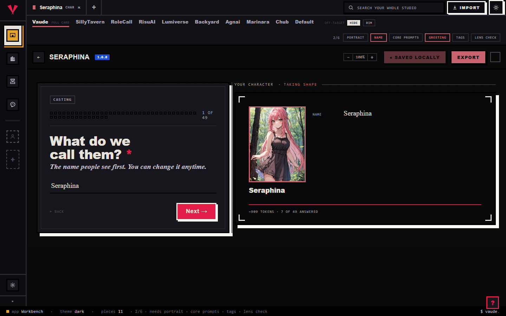

# Export a piece

Exporting writes a piece out in a specific platform's shape and hands you a file. There are two ways to do it: the Export button on a character's editor, one piece at a time, with the full honesty view of what will and will not travel, or staging for the Press, a whole batch at once, where each card shows a readiness line instead.

## The short version

1. **Open the character on the Workbench.** The Export button lives on the character editor only; for a lorebook, persona, or preset, skip to staging below.
2. **Click Export**, top of the editor.
3. **Pick a platform.** The list only shows formats for this piece's kind; Risu or SillyTavern is chosen for you first if either is available.
4. **Read the lines.** Each one states a fact plainly, or opens with Note: for a partial, or Dropped: for something that will not travel at all.
5. **Click Export, or Export anyway.** The button relabels itself the moment anything on the card deserves a second look. Either way, one file downloads immediately, no zip.

## Reading the honesty view

@fig honesty

Every export runs the same check before it hands you a file: does the target even carry Vaude's behavior shape, the trigger scripts, regex, virtual script, backdrop HTML, and any packaged module rows a card can carry.

**When the target carries behavior, scripts keep.** A format that claims Vaude's behavior shape re-exports your trigger scripts, regex, virtual script, and backdrop HTML along with the plain fields. A packaged module goes further only on Risu, where its .charx package re-packs the module's scripts and lore whole; anywhere else that still carries behavior, the module blob itself may not survive intact.

**When it does not, scripts drop, plain fields stay.** A leaner format has no place to run Vaude's rules, so trigger scripts, regex, virtual script, and backdrop HTML are marked dropped, not silently lost, you are told. Name, description, greetings, and the rest of the plain card still export regardless. If the rule pack matters, the dialog points you at Risu (.charx) instead.

A concrete case. Export a card with an expression pack and a linked lorebook to Agnai. The pack is marked dropped outright, Agnai has no PNG-pack recipe, only its own part system, and the linked lorebook maps into an Agnai MemoryBook with a warning that its regex keys may not survive the trip. Export the same card to SillyTavern or Risu instead and both lines read keep.

You never have to guess which case you are in. Chips above the list already show what media rides on the card, a portrait, an expression pack, named assets, before you have even picked a platform.

## Staging for the Press

The Press is the only way to export a lorebook, persona, or preset on its own, and the only way to export more than one piece in a single run.

Right-click any piece, in the Library or on the Workbench, and choose Stage for the Press, or click one on the left rail inside the Press itself. The queue survives switching rooms. Stage a character and his linked lorebooks ride along automatically as a kit, even ones you never separately staged; drop a rider out of just this run without unlinking it (drop from this run, then ride again to bring it back).

Pick one target for the whole queue. The Press does not show the honesty view, keep, note, dropped, that lives on the single-piece Export button. It shows readiness instead. Every staged lorebook checks its own keywords right away, no target needed: an entry with none at all reads red, it will never fire; some entries missing keywords reads amber instead, naming how many. A staged character needs a target picked first, then its line reads how many of that platform's fields are actually filled in, with the empty ones named. If a piece is not ready, open in the editor sends it to the Workbench without losing your spot in the queue.

Click run the press. Each row settles as printed, sometimes with a note on what media it carried along, skipped when the target has no format for that kind of piece, or failed with the reason. Once at least one row prints, download the bundle appears, and it is always a zip, even for a single staged piece.

## Tips

- The Export button lives on the character editor only. To export a lorebook, persona, or preset by itself, stage it for the Press instead, even just the one piece, and run it there.
- The Export button relabels itself Export anyway the moment a line opens with Note: or Dropped:. That is not a hard stop, just the studio making sure you saw it before you clicked past it.
- Readiness in the Press queue is not the honesty view. It tells you whether your own fields are filled in, not what the wire format keeps or drops; for that breakdown, use Export on the character's editor.
- Rename a row or pick a plain-text flavor (.txt or .md, alongside the format's normal extension) before you click run the press. Those fields lock once the row has a result.
- A lorebook with zero keyworded entries reads red in the queue and will never fire, on any platform. Fix the keywords before you stage it.
