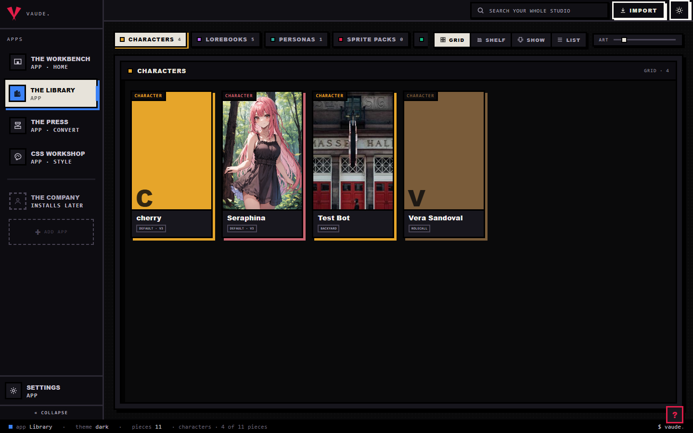

# Get started

Getting started is four things: install Hoplight, run the first-run wizard once, learn the rooms the Dock shows you, and bring your first file into the Library. None of the wizard's answers are a one-way door; every one of them can change later in Settings.

## The short version

1. **Install Bun, then Hoplight.** Bun 1.3+ is the only thing you install yourself.
   ```bash
   git clone https://github.com/Coneja-Chibi/Hoplight
   cd Hoplight
   bun install
   ```
2. **Open the studio.**
   ```bash
   bun run dev
   ```
   This starts a loopback-only server and prints its address, `127.0.0.1:8321` by default. Open that in your browser. Your pieces live as plain JSON in a studio folder at `~/Documents/Hoplight Studio` unless you point it elsewhere: `bun run hoplight ui 8321 path/to/studio`.
3. **Answer the wizard, or don't.** The very first run only, it asks four questions. Skip all fills in the defaults and drops you straight into the studio; every answer can still change in Settings afterward.
4. **Land on the Library's two doors.** A brand-new studio opens here exactly once. Drag a file onto the primary door, or click it to browse for one.
5. **Check the receipt, then click Import.** Uncheck anything you do not want kept. Import only writes the pieces still checked.


## The first-run wizard

The wizard only appears once, the first time `bun run dev` finds no completed setup in your studio's settings. Once you finish it, or skip it, it never comes back on its own. It asks four questions, in this order:

1. **Light or dark?** Light or Dark. Dark is the default.
2. **What do you want to make first?** Characters, Lorebooks, Personas, Sprite packs, or Presets. Characters is the default. This only decides which deck the Library opens on the first time you see it; nothing is locked to it.
3. **Where do you publish?** A multi-select list, pulled live from every platform format Hoplight currently knows (so a new format you drop in earns a slot automatically). Not sure yet is the default and keeps every slot ready either way.
4. **Pick your color.** One accent color for the whole workspace, chosen from the house palette. Rose is the default. Setup does not offer a custom color, only Settings and a piece's own editor do that.

Skip all at any point fills whatever is left with its default and jumps to the closing screen. That screen says "You're set," recaps what you picked, and Open Hoplight carries it into the studio.

@fig boot

Theme, first deck, publish targets, and accent all live in Settings after this, so nothing you pick here is permanent. What is permanent is the moment itself, this wizard runs on your very first launch and then gets out of the way for good.

## The Dock

The Dock is the column of app tiles down the side of the studio. Four rooms are open for work today:

- **The Workbench** is where a piece you send to it gets edited, character, lorebook, persona, regex set, preset, or pack, each with its own editor pane. It is also home: every boot after your first lands you here (or wherever you last were), not just the very first one.
- **The Library** is the browse room: six decks (Characters, Lorebooks, Personas, Sprite packs, Presets, Regex sets), deck chips with live counts, a few view modes, and the door your files come in through.
- **The Press** ships work out. It only ever works a staged queue: right-click a piece anywhere and choose Stage for the Press, pick one target platform, click run the press, then download the bundle.
- **The CSS Workshop** restyles the studio itself, since every color in it is a token you can repaint.

Below a divider sits a dimmed tile marked "installs later," that's The Company, not open yet. Settings is pinned into the Dock's foot, below the tray, always reachable. The whole Dock can collapse to marks-only with the toggle at its bottom edge, and it does that on its own whenever you have a piece open for editing.



## Bringing in your first file

On an empty studio, the Library's primary door does two jobs: drop a file onto it, or click it to open a file picker. Once your studio has pieces in it, that door is gone, but import still works the same way, drop a file anywhere on the Library and the same flow runs.

Every file you bring in gets read before anything is written. You see one of two headings: "Pick what to keep," when everything you dropped read cleanly, or "Here is what we read," when some of it didn't. Each readable file shows as a receipt, name, what kind of piece it is, and a checkbox, checked by default. A file Hoplight could not read shows its own line instead, with a plain-words reason, and no checkbox. Add more files appends to the batch without starting over; Import N writes only the pieces still checked; Not now closes the overlay and writes nothing.

An honest note: the empty studio's second door, "Click here to start fresh," is there but isn't wired to anything yet beyond a status-bar line. Bringing in a file is the working path; lean on that for now.


## Tips

- Bun 1.3+ is genuinely the only prerequisite. A single downloaded executable is planned for a later release; today's working path is clone, `bun install`, `bun run dev`.
- The wizard's Skip all is not a lesser path. Every question it asks is also a Settings field, so skipping costs you nothing you can't fix in ten seconds later.
- The Library opens on the deck you picked in "What do you want to make first?" the first time, and remembers whatever deck you last had open after that.
- A lorebook that arrives attached to a character comes in as one bundle under one receipt row; that row's entry count is the lorebook's.
- If a file's receipt reads "We could not read this one," that's a format Hoplight does not recognize yet, not a broken file. `bun run hoplight formats` lists everything currently supported.
- Point the studio at a different folder any time with `bun run hoplight ui 8321 path/to/studio`. Nothing about your studio folder is baked into the install.
