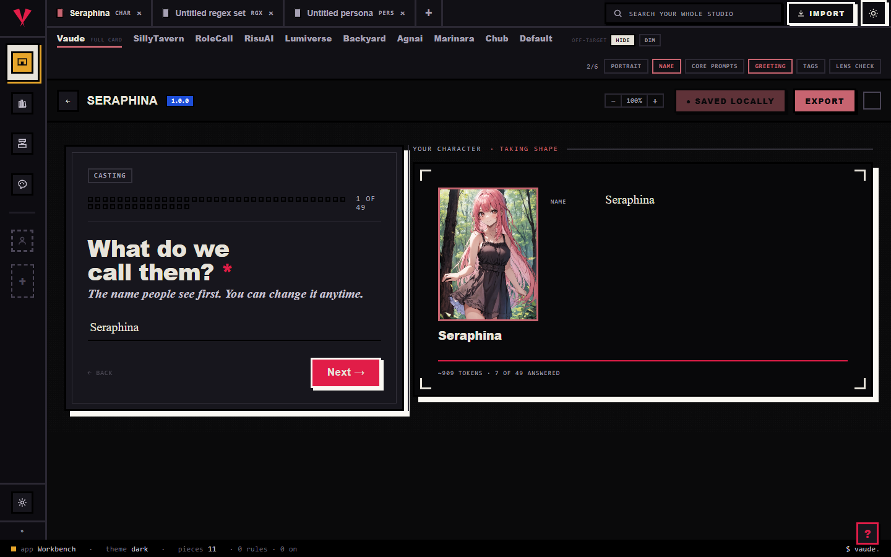

# Marinara

Marinara-Engine is a roleplay platform, and it has no import or export screen of its own: what you bring into Hoplight is a dump straight from its server, either your regex scripts or your personas. This page shows you how to bring those into Hoplight, edit them, and send them back out, whether to Marinara-Engine again or to another app.

@fig journey

## What Hoplight reads

Hoplight reads two file types out of Marinara-Engine, both bare `.json`:

- **Regex scripts**, as an array: one row per script, the same shape Marinara's server hands back from `GET /regex-scripts`.
- **Personas**, as an object: one persona's sections, its comment and avatar, plus its theming and stat bars.

A Marinara character card is a different piece entirely. It is SillyTavern-shaped, so it comes in and goes back out through [the SillyTavern page](sillytavern.md); its Marinara-only fields, like stat bars and tracker colors, live under a dedicated Marinara tab on that card's editor, not here.

Hoplight recognizes a regex or persona file by looking inside it, not by name or extension. A regex dump has to carry something SillyTavern's own regex scripts never do, because the two wires otherwise look identical: `targetCharacterIds`, an `order` number, or a placement value such as `ai_output` or `user_input`. A persona has to carry an id, a name, a description and personality, plus at least one theming or stat key like `nameColor` or `personaStats`, a combination no other platform's persona file matches.

To bring one in, drag the file onto the Library and drop it anywhere in the room. For the full walkthrough, see [the importing guide](../importing.md).

## What comes across cleanly

Importing loses nothing. Hoplight keeps a complete copy of the file you dropped, then lifts the parts you actually work with into fields you can edit directly.

For a **regex script**, that is close to everything on the row:

- The pattern and its replacement
- The flags
- Trim strings, fragments stripped from the match before the replacement runs
- Where it runs: the input side, the output side, or both, and whether it is prompt-only
- The depth window it applies to
- Which characters it is limited to, if any
- Whether it is on, and its position in the set

Only the row's own created and updated timestamps have nowhere to go on the canonical side, and those ride quietly in the background.

For a **persona**, Hoplight lifts:

- Name and description, the persona's own first-person voice
- The comment, shown as its short blurb
- The appearance, personality, and backstory sections
- The avatar

A Marinara persona carries more than that, though: its own per-persona chat theming (name, dialogue, and box colors), its stat bars, an avatar crop, tags, and a scenario field. None of that has a shared home in Hoplight's persona model, so it rides sealed in the background rather than being dropped, and comes back exactly as it was on an export back to Marinara.

## What changes when you convert to another app

This is the honest part, and it is simple once you see the rule.

A same-app round-trip keeps everything, for both kinds. Import a regex dump or a persona, edit it, and export it back to Marinara-Engine, and you get everything back, because Hoplight kept the original file and only re-writes the fields you changed.

Converting to a different app is where things drop, and the two kinds do not drop by the same amount.

**Regex scripts**

| Content | Back to Marinara-Engine | To another app |
| --- | --- | --- |
| Pattern, replacement, flags, trim strings, where it runs, prompt-only, depth window, character targets, on/off, order | Kept | Comes across, as far as that app's regex engine can hold it |
| Marinara's own created and updated timestamps | Kept | Dropped |

A regex script only has somewhere to land if the target app has a regex slot at all. SillyTavern, RoleCall, Risu, and Lumiverse do; a plainer app like Agnai or Backyard does not, so the Press skips that piece for that run rather than guessing where to put it.

**Personas**

| Content | Back to Marinara-Engine | To another app |
| --- | --- | --- |
| Name, description, appearance, personality, and backstory sections, comment, avatar | Kept | Comes across, as far as that app can hold it |
| Chat theming (name, dialogue, and box colors), stat bars, avatar crop, tags, scenario, Marinara's own persona id | Kept | Dropped |

Fewer apps take a persona at all: only SillyTavern, RoleCall, and Lumiverse have a persona slot. Converting to Risu, Agnai, or Backyard skips the piece the same way a regex script does on an app with no slot for it.

"Another app" is the drop rule working as designed, not a missing feature. Hoplight never blind-copies one app's theming, stat bars, or scripts into another app's file; your regex stays where it actually runs, and where the target simply has fewer slots than Marinara, whatever it cannot hold is dropped on its side, not yours.

## Editing on the Workbench

Send a piece from the Library to the Workbench and it opens as a tab.

A **regex set** opens as one rule per page down a table of contents: pattern, replacement, flags, where it fires, and a fine-print panel for the rest. Switch the "Writing for" strip to Marinara and the fine print narrows to what Marinara's own wire actually owns, the depth window and character targets, and hides controls it has no place for, like macro substitution and run-on-edit. Three controls are Hoplight-only and show under every lens regardless, flagged as not portable to any platform: first match only, overlay, and conditional chaining.

A **persona** opens as a name, a portrait, and section tiles, among them appearance, personality, and backstory (the editor labels that one History), the three a Marinara persona actually fills, alongside the full first-person text and a live preview of what actually gets injected. Switch "Writing for" to Marinara here too and the editor narrows to what travels: name, sections, and the avatar. The color palette and the injection-position picker both stay hidden under this lens, because Marinara's own wire has no place for either; its real theming and stat bars keep riding sealed and only reappear untouched on an export straight back to Marinara.

When you save, Hoplight writes the whole regex set or persona back, so the parts you did not touch stay exactly as they were.

## Exporting back out

When a piece is ready to leave, stage it for the Press: right-click it and choose "Stage for the Press," or drop it in from the Press's own rail. The Press works only the pieces you staged, and each run exports to one target format that you pick.

Hoplight writes both a Marinara regex set and a Marinara persona as `.json`, the only file shape Marinara itself understands, since it has no other file format of its own. You can also ask for a plain `.txt` or `.md` copy of either when you just want to read the text. Choosing a different app as the target applies the drop story above: a regex set travels to any app with a regex slot, a persona to any app with a persona slot, and each drops what that app cannot hold.

## Common questions

- **Will my regex set or persona come back exactly as it was?** Yes, if you export it back to Marinara-Engine. Same app in, same app out, nothing lost.
- **Where do my Marinara character cards go?** Not through this page. A Marinara character card is SillyTavern-shaped, so it comes in and goes back out through [the SillyTavern page](sillytavern.md), stat bars and tracker colors included, under a dedicated Marinara tab on that card's editor.
- **What happened to my persona's colors and stat bars?** They are still there. Marinara's own theming and stat bars have no shared field in Hoplight, so they ride sealed in the background instead of showing up as editable controls, and come back untouched on an export straight back to Marinara.
- **Why does the Workbench hide some controls when I pick a platform?** The "Writing for" strip narrows the editor to what that platform's wire can actually carry, so you are never filling in a field that would just get thrown away on export. Switch back to the full Hoplight lens to see every field at once, whatever the source.
- **Can I limit a regex script to one character?** Yes. Marinara scripts carry a character-targets list, and Hoplight keeps it as the rule's character targets; an empty list means the rule applies to everyone, same as on the wire.
