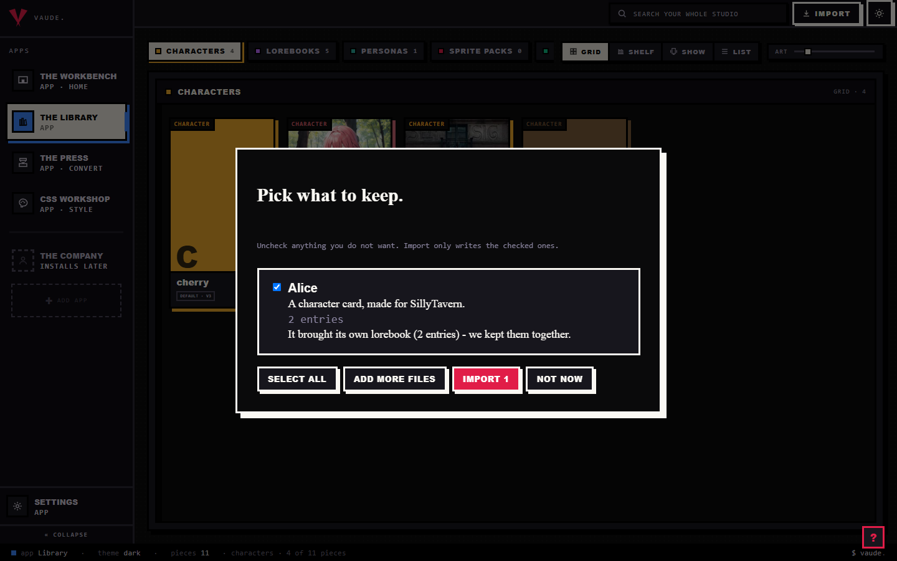
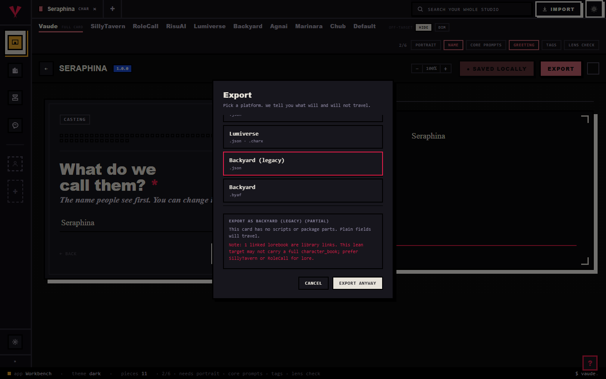

# Troubleshoot common problems

Most of what looks broken in Hoplight already told you what happened, in plain words, at the moment it happened. A failed import names a reason. An export lists a Note or a Dropped line for every field that didn't travel. A Press row settles as printed, skipped, or failed, and says why. This page walks the three places that message shows up: a card that would not import, a convert that dropped something, and an export that looks wrong.

## The short version

1. **Read the message you already have.** A receipt line, a Note or Dropped line, a Press row's note: each one states a fact, not a guess. Start there before you assume something is broken.
2. **Ask the file what it is.** From a terminal in the project folder, `hoplight inspect <file>` names the kind and format Hoplight sees, or says plainly it could not be read; `hoplight validate <file>` exits 0 if the file opens at all.
3. **Check the lens or the honesty view before you export again.** Pick the target platform on the Workbench and read what's dimmed, or open Export and read the Note and Dropped lines. Both read off the same coverage claims, so they never disagree with each other.
4. **Check the format matrix if one specific field is the question.** `docs/FORMAT-SUPPORT.md` is generated straight from the live adapters: what each platform reads and writes, kind by kind.
5. **If none of that explains it, the file may be a format Hoplight doesn't know yet, not a broken one.** `hoplight formats` lists everything currently supported.

## A card would not import

@fig causes

Every file is read before anything is written, and the result always comes back under one of two headings: "Pick what to keep" when everything read cleanly, or "Here is what we read" when some of it didn't. A checkbox and a plain reason sit on every row; nothing you dropped is skipped without you seeing why.

- **"We could not read this one."** That line means Hoplight doesn't recognize the format, not that your file is damaged. It's looking for a card, book, or persona shape it knows: png, json, charx, lorebook, byaf. Run `hoplight inspect` on the same file for the same answer from a terminal before you file it as broken.
- **It imported, but you now have two of it.** Importing never overwrites. Drop the same file twice and the second copy lands with -2 tacked onto its id, on purpose, so a stray re-drop can never quietly clobber a piece you've already edited. If you meant to update the piece you already have, open it on the Workbench and save from there; that path overwrites, importing never does.
- **A lorebook came in with fewer or different entries than you expected.** A book with a missing name or a malformed entry is healed on the way in, not rejected. Read the receipt's extra lines: they name what was fixed and how many entries were kept, so you're never guessing what changed.
- **A card's scripts or regex don't seem to do anything.** That's by design. Scripts are saved as text and stay inert; the receipt says so directly, that they'll never run unless you put them on the test stage. On the Workbench, switch Fields to Workshop in the header to see a character's scripts (a piece with none never shows that toggle), or open the regex set itself to see its rules.
- **The receipt says a card asked for deep access.** Hoplight refuses that request outright and says so on the receipt; the rest of the card still imports normally.
- **Clicking Import doesn't open a file browser.** Once your studio has any pieces in it, that button only carries you to the shelves and reminds you to drop a file there. A real file browser only appears on a brand-new, empty studio.

## A convert dropped something

Every convert reads a file into one shared canonical model, then writes it back out in the target's shape (see Convert a card for the full mechanism). Most of what gets reported as a bug here is that model doing exactly what it's built to do.

- **You converted to a different app and scripts, regex, or a module are gone.** Expected. Only the shared canonical model crosses between different apps; one app's private scripts or extension blocks are never copied into a file that never asked for them. If the full rule pack has to travel, target a format that keeps it, Risu's .charx.
- **You converted back to the same app you started in, and it still looks different.** "Same app" means the same format id both ways, not just a similar-looking one. A card you imported from RoleCall and then export as plain SillyTavern JSON is a cross-format convert, not a round trip, even though both read as "SillyTavern-ish" at a glance. Export back through the exact format you imported from for the byte-honest copy.
- **A converted persona left a linked lorebook behind.** SillyTavern, RoleCall, and Lumiverse each carry a single lorebook reference on their persona wire, not a list. If you'd attached more than one, only the first crosses. Reorder the Knowledge card if a different book should be the one that travels, or stage the lorebook itself so it goes out on its own.
- **A lorebook entry landed in a different spot than you set.** The richer placement stops (Scene, Depth, Top, Bottom, and the rest) only exist under the Hoplight lens and a handful of platforms; Risu and NovelAI have no placement dial at all, every entry lands on the character floor there regardless of what you picked. A position your target can't carry is marked foreign and lands at its closest slot instead, not lost.
- **A staged character's lorebook is missing from the zip, or printed twice.** A staged character brings its linked lorebooks along automatically as a kit; a book already riding a kit that way is never printed a second time, even if you also staged it on its own. Use "drop from this run" on the Press to leave one out for a single run without unlinking it, and "ride again" to bring it back.

## An export looks wrong

The single-piece Export button and the Press read the same coverage claims the Workbench lens does. If one of them says a field carries, the other agrees.

- **Fields are dimmed or missing on the Workbench.** That's the lens doing its job: pick a platform tab and the fields it can't carry leave the form, dimmed or hidden depending on your setting. Click the Hoplight tab to see the whole card again; nothing was deleted, only hidden from view.
- **The Export button suddenly reads "Export anyway."** It relabels itself the instant a line on the honesty view opens with Note: or Dropped:. That's not a hard stop, it's the studio making sure you saw the line before you click past it. Note means partial, Dropped means it doesn't travel at all.
- **A Press row reads skipped.** The note names the reason plainly, something like "Agnai has no persona format." That's declared before the run even starts, not a failure: a lorebook, persona, or preset simply has nowhere to land on a platform whose wire never carried that kind of piece.
- **A Press row reads failed.** Unlike skipped, that's a real error on that specific row; the note is the actual message, not a placeholder. The rest of the batch keeps running.
- **A filename in the zip has -2 on the end, or isn't what you typed.** Two rows that would collide on the same name get minted apart automatically, `adrian.json`, `adrian-2.json`. Rename a row, or pick a plain-text flavor (.txt or .md), before you click run the press; both fields lock once that row has a result.
- **You expected a zip and got one file, or the other way around.** The character editor's own Export button always hands you one file, no zip, even for a single piece. The Press always downloads a zip, even when only one piece is staged. Pick the one that matches what you actually wanted before you export.
- **A casting-card field like full name, title, or pronouns didn't cross.** Those live in the casting card group on the Workbench. A platform with no matching slot leaves them behind the same way it would a script. Check the lens for that platform rather than assuming the field itself is broken.

## Tips

- Read the message first. It was already the answer; you just walked past it on the way to filing a bug.
- `hoplight inspect`, `hoplight validate`, and `hoplight formats` answer "is this even a file we know" faster than clicking through the studio.
- Same-app round trip is the lossless baseline. If you need a byte-honest copy back, export through the exact format you imported from, not just a similar-looking one.
- The lens and the honesty view read one shared coverage table. If a field is dimmed on the Workbench, it will read Dropped on Export too, so check whichever one is already open.
- If a format genuinely isn't supported yet, that's not a broken file. Open an issue with a sample rather than fighting the importer.
